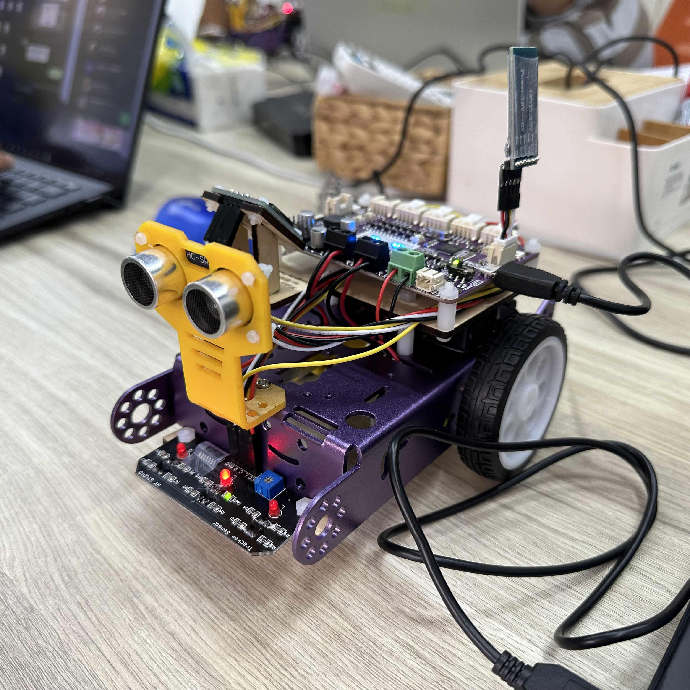

# 藍芽自走車-創客夏令營

## 上課簡介
  * 認識 _Raspberry Pi Pico_ 
  * 使用 _Thonny_ 撰寫 _Python_
  * 搭配 OLED、藍芽、循跡等傳感器

## 上課日期  
 * 2023/7/3~7/7

## 123
<table>
    <tr>
        <td>專案名稱</td>
        <td>說明</td>
        <td>備註</td>
    </tr>
    <tr>
        <td>Binodata.QQOO.Member.Web</td>
        <td>娃娃機會員雲端管理系統專案</td>
        <td></td>
    </tr>
    <tr>
        <td>Binodata.QQOO.Admin.Web</td>
        <td>娃娃機裝置管理系統專案</td>
        <td></td>
    </tr>
    <tr>
        <td>Binodata.IoT.Library</td>
        <td>系統所需要使用的專案</td>
        <td>於另一個Git儲存庫，[連結](url)</td>
    </tr>
</table>

## 課程連結
  * [2023自走車暑期營隊學員講義(Google Drive)](https://drive.google.com/drive/u/1/folders/1zn8TNLiltXHVvuN02wAW3QgiqbFKKlrb)

## 開發環境
* Thonny 4.1.1
* Python 3.10.11
* Maker Pi RP2024

## 結構大綱
 + mods/
   + 課堂提供模組檔案
 + simple/
   + 基本練習程式
 + image/
   + 圖片

