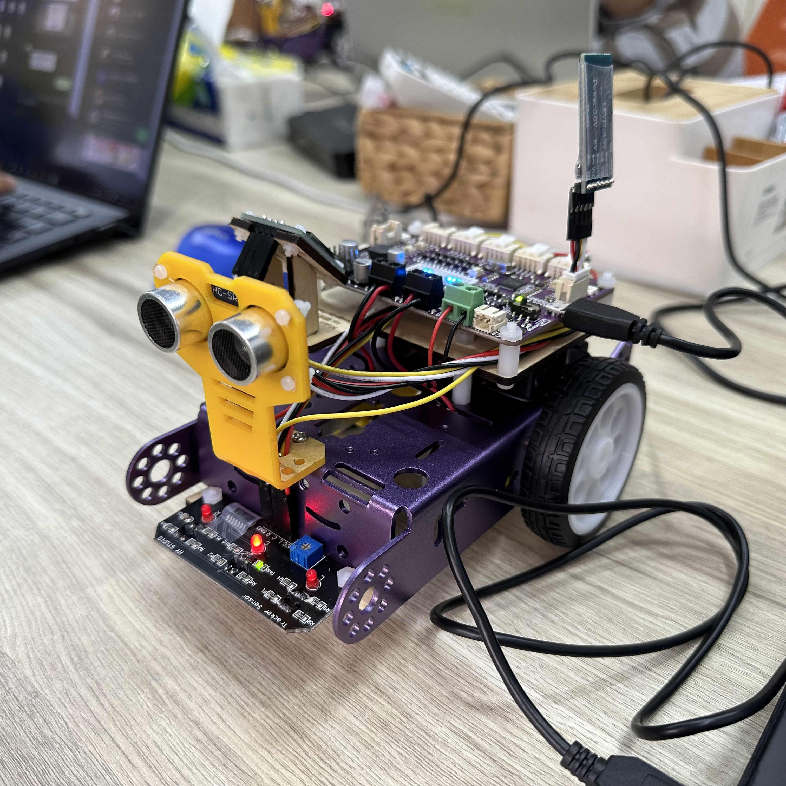

# 藍芽自走車-創客夏令營

## 上課簡介
  * 認識 _Raspberry Pi Pico_ 
  * 使用 _Thonny_ 撰寫 _Python_
  * 搭配 OLED、藍芽、循跡等傳感器

## 上課日期  
 * 2023/7/3~7/7

## 課程連結
  * [2023自走車暑期營隊學員講義(Google Drive)](https://drive.google.com/drive/u/1/folders/1zn8TNLiltXHVvuN02wAW3QgiqbFKKlrb)

## 開發環境
* Thonny 4.1.1
* Python 3.10.11
* Maker Pi RP2024

## 資料夾大綱
 + [BT_Car/](https://github.com/ChuanPien/BTCar/tree/main/BT_Car)
   + 藍芽遙控車
 + [Music/](https://github.com/ChuanPien/BTCar/tree/main/Music)
   + 蜂鳴器練習
 + [Sensor_Car/](https://github.com/ChuanPien/BTCar/tree/main/Serson_Car)
   + 循跡自走車
 + [image/](https://github.com/ChuanPien/BTCar/tree/main/image)
   + 課程照片
 + [mods/](https://github.com/ChuanPien/BTCar/tree/main/mods)
   + 課堂提供模組檔案
 + [simple/](https://github.com/ChuanPien/BTCar/tree/main/simple)
   + 基本練習程式
 + [src/](https://github.com/ChuanPien/BTCar/tree/main/src)
   + 資料圖片

